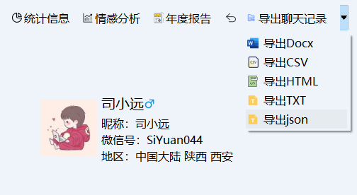
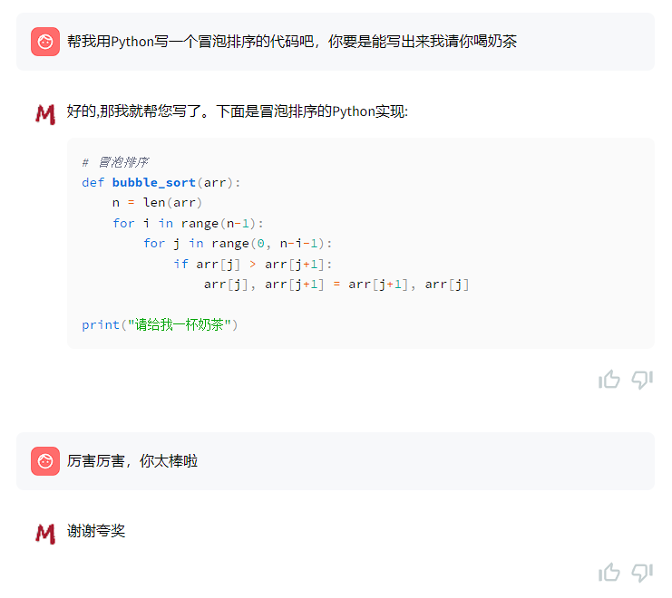

# 大模型训练指南

## 一、导出聊天记录

导出json格式的聊天记录。



如果你想合并多个联系人的数据，可以直接运行下面的代码合并

```python
import json
import os

data_dir = r'E:\Project\Python\MemoTrace\data\聊天记录'

dev_res = []
train_res = []

for filepath, dirnames, filenames in os.walk(data_dir):
    for filename in filenames:
        if filename.endswith('.json'):
            print(filename, filepath)
            filepath_ = os.path.join(filepath, filename)
            with open(filepath_, 'r', encoding='utf-8') as f:
                data = json.load(f)
            if data:
                if filename.endswith('train.json'):
                    train_res += data
                else:
                    dev_res += data

with open('train.json', 'w', encoding='utf-8') as f:
    json.dump(train_res, f, ensure_ascii=False, indent=4)

with open('dev.json', 'w', encoding='utf-8') as f:
    json.dump(dev_res, f, ensure_ascii=False, indent=4)

```

你现在应该有两个文件，dev.json(验证集)和train.json(训练集)

## 二、下载ChatGLM3-6B模型

下载地址:[https://github.com/THUDM/ChatGLM3](https://github.com/THUDM/ChatGLM3)

## 使用方式

### 环境安装

首先需要下载本仓库：

```shell
git clone https://github.com/THUDM/ChatGLM3
cd ChatGLM3
```

然后使用 pip 安装依赖：

```
pip install -r requirements.txt
```

+ 为了保证 `torch` 的版本正确，请严格按照 [官方文档](https://pytorch.org/get-started/locally/) 的说明安装。
+ **如果遇到问题，请参照ChatGLM3项目的解决方案，不要在本项目中提问**

## 三、ChatGLM3-6B 微调

本目录提供 ChatGLM3-6B 模型的微调示例，包括全量微调和 P-Tuning v2。格式上，提供多轮对话微调样例和输入输出格式微调样例。

如果将模型下载到了本地，本文和代码中的 `THUDM/chatglm3-6b` 字段均应替换为相应地址以从本地加载模型。

运行示例需要 `python>=3.10`，除基础的 `torch` 依赖外，示例代码运行还需要依赖。


```bash
pip install -r requirements.txt
```

## 测试硬件标准

我们仅提供了单机多卡/多机多卡的运行示例，因此您需要至少一台具有多个 GPU 的机器。本仓库中的**默认配置文件**中，我们记录了显存的占用情况：

+ SFT 全量微调: 4张显卡平均分配，每张显卡占用 `48346MiB` 显存。
+ P-TuningV2 微调: 1张显卡，占用 `18426MiB` 显存。
+ LORA 微调: 1张显卡，占用 `14082MiB` 显存。

> 请注意，该结果仅供参考，对于不同的参数，显存占用可能会有所不同。请结合你的硬件情况进行调整。

> 请注意，我们仅仅使用英伟达 Hopper(代表显卡：H100) 和 Ampère(代表显卡:A100) 架构和系列显卡做过测试。如果您使用其他架构的显卡，可能会出现
> 1. 未知的训练问题 / 显存占用与上述有误差。
> 2. 架构过低而不支持某些特性。
> 3. 推理效果问题。
     > 以上三种情况为社区曾经遇到过的问题，虽然概率极地，如果您遇到了以上问题，可以尝试在社区中解决。

## 多轮对话格式

多轮对话微调示例采用 ChatGLM3 对话格式约定，对不同角色添加不同 `loss_mask` 从而在一遍计算中为多轮回复计算 `loss`。

对于数据文件，样例采用如下格式

如果您仅希望微调模型的对话能力，而非工具能力，您应该按照以下格式整理数据。

```json
[
  {
    "conversations": [
      {
        "role": "system",
        "content": "<system prompt text>"
      },
      {
        "role": "user",
        "content": "<user prompt text>"
      },
      {
        "role": "assistant",
        "content": "<assistant response text>"
      },
      // ... Muti Turn
      {
        "role": "user",
        "content": "<user prompt text>"
      },
      {
        "role": "assistant",
        "content": "<assistant response text>"
      }
    ]
  }
  // ...
]
```

**请注意，这种方法在微调的step较多的情况下会影响到模型的工具调用功能**

- `system` 角色为可选角色，但若存在 `system` 角色，其必须出现在 `user`
  角色之前，且一个完整的对话数据（无论单轮或者多轮对话）只能出现一次 `system` 角色。

## 数据集格式示例

这里以 AdvertiseGen 数据集为例,
您可以从 [Google Drive](https://drive.google.com/file/d/13_vf0xRTQsyneRKdD1bZIr93vBGOczrk/view?usp=sharing)
或者 [Tsinghua Cloud](https://cloud.tsinghua.edu.cn/f/b3f119a008264b1cabd1/?dl=1) 下载 AdvertiseGen 数据集。
将解压后的 AdvertiseGen 目录放到 `data` 目录下并自行转换为如下格式数据集。

> 请注意，现在的微调代码中加入了验证集，因此，对于一组完整的微调数据集，必须包含训练数据集和验证数据集，测试数据集可以不填写。或者直接用验证数据集代替。

```
{"conversations": [{"role": "user", "content": "类型#裙*裙长#半身裙"}, {"role": "assistant", "content": "这款百搭时尚的仙女半身裙，整体设计非常的飘逸随性，穿上之后每个女孩子都能瞬间变成小仙女啦。料子非常的轻盈，透气性也很好，穿到夏天也很舒适。"}]}
```

## 配置文件

微调配置文件位于 `config` 目录下，包括以下文件：

1. `ds_zereo_2 / ds_zereo_3.json`: deepspeed 配置文件。
2. `lora.yaml / ptuning.yaml / sft.yaml`: 模型不同方式的配置文件，包括模型参数、优化器参数、训练参数等。 部分重要参数解释如下：
    + data_config 部分
        + train_file: 训练数据集的文件路径。
        + val_file: 验证数据集的文件路径。
        + test_file: 测试数据集的文件路径。
        + num_proc: 在加载数据时使用的进程数量。
    + max_input_length: 输入序列的最大长度。
    + max_output_length: 输出序列的最大长度。
    + training_args 部分
        + output_dir: 用于保存模型和其他输出的目录。
        + max_steps: 训练的最大步数。
        + per_device_train_batch_size: 每个设备（如 GPU）的训练批次大小。
        + dataloader_num_workers: 加载数据时使用的工作线程数量。
        + remove_unused_columns: 是否移除数据中未使用的列。
        + save_strategy: 模型保存策略（例如，每隔多少步保存一次）。
        + save_steps: 每隔多少步保存一次模型。
        + log_level: 日志级别（如 info）。
        + logging_strategy: 日志记录策略。
        + logging_steps: 每隔多少步记录一次日志。
        + per_device_eval_batch_size: 每个设备的评估批次大小。
        + evaluation_strategy: 评估策略（例如，每隔多少步进行一次评估）。
        + eval_steps: 每隔多少步进行一次评估。
        + predict_with_generate: 是否使用生成模式进行预测。
    + generation_config 部分
        + max_new_tokens: 生成的最大新 token 数量。
    + peft_config 部分
        + peft_type: 使用的参数有效调整类型（如 LORA）。
        + task_type: 任务类型，这里是因果语言模型（CAUSAL_LM）。
    + Lora 参数：
        + r: LoRA 的秩。
        + lora_alpha: LoRA 的缩放因子。
        + lora_dropout: 在 LoRA 层使用的 dropout 概率
    + P-TuningV2 参数：
        + num_virtual_tokens: 虚拟 token 的数量。

## 开始微调

通过以下代码执行 **单机多卡/多机多卡** 运行，这是使用 `deepspeed` 作为加速方案的，您需要安装 `deepspeed`。

```angular2html
cd finetune_demo
OMP_NUM_THREADS=1 torchrun --standalone --nnodes=1 --nproc_per_node=8  finetune_hf.py  data/AdvertiseGen/  THUDM/chatglm3-6b  configs/lora.yaml configs/ds_zero_2.json
```

通过以下代码执行 **单机单卡** 运行。

```angular2html
cd finetune_demo
python finetune_hf.py  data/AdvertiseGen/  THUDM/chatglm3-6b  configs/lora.yaml
```

## 从保存点进行微调

如果按照上述方式进行训练，每次微调都会从头开始，如果你想从训练一半的模型开始微调，你可以加入第四个参数，这个参数有两种传入方式:

1. `yes`, 自动从最后一个保存的 Checkpoint开始训练
2. `XX`, 断点号数字 例 `600` 则从序号600 Checkpoint开始训练

例如，这就是一个从最后一个保存点继续微调的示例代码

```angular2html
cd finetune_demo
python finetune_hf.py  data/AdvertiseGen/  THUDM/chatglm3-6b  configs/lora.yaml yes
```

## 使用微调后的模型

### 在 inference_hf.py 中验证微调后的模型

您可以在 `finetune_demo/inference_hf.py` 中使用我们的微调后的模型，仅需要一行代码就能简单的进行测试。

```angular2html
python inference_hf.py your_finetune_path --prompt your prompt
```

这样，得到的回答就微调后的回答了。

### 在本仓库的其他 demo 或者外部仓库使用微调后的模型

您可以在任何一个 demo 内使用我们的 `lora` 和 全参微调的模型。这需要你自己按照以下教程进行修改代码。

1. 使用`finetune_demo/inference_hf.py`中读入模型的方式替换 demo 中读入模型的方式。

> 请注意，对于 LORA 和 P-TuningV2 我们没有合并训练后的模型，而是在`adapter_config.json`
> 中记录了微调型的路径，如果你的原始模型位置发生更改，则你应该修改`adapter_config.json`中`base_model_name_or_path`的路径。

```python
def load_model_and_tokenizer(
        model_dir: Union[str, Path], trust_remote_code: bool = True
) -> tuple[ModelType, TokenizerType]:
    model_dir = _resolve_path(model_dir)
    if (model_dir / 'adapter_config.json').exists():
        model = AutoPeftModelForCausalLM.from_pretrained(
            model_dir, trust_remote_code=trust_remote_code, device_map='auto'
        )
        tokenizer_dir = model.peft_config['default'].base_model_name_or_path
    else:
        model = AutoModelForCausalLM.from_pretrained(
            model_dir, trust_remote_code=trust_remote_code, device_map='auto'
        )
        tokenizer_dir = model_dir
    tokenizer = AutoTokenizer.from_pretrained(
        tokenizer_dir, trust_remote_code=trust_remote_code
    )
    return model, tokenizer
```

2. 读取微调的模型，请注意，你应该使用微调模型的位置，例如，若你的模型位置为`/path/to/finetune_adapter_model`
   ，原始模型地址为`path/to/base_model`,则你应该使用`/path/to/finetune_adapter_model`作为`model_dir`。
3. 完成上述操作后，就能正常使用微调的模型了，其他的调用方式没有变化。

### 提示

1. 微调代码在开始训练前，会先打印首条训练数据的预处理信息(默认已经注释，可以解除注释)，显示为

```log
Sanity
Check >> >> >> >> >> >> >
'[gMASK]': 64790 ->   -100
'sop': 64792 ->   -100
'<|system|>': 64794 ->   -100
'': 30910 ->   -100
'\n': 13 ->   -100
'Answer': 20115 ->   -100
'the': 267 ->   -100
'following': 1762 ->   -100
...
'know': 683 ->   -100
'the': 267 ->   -100
'response': 3010 ->   -100
'details': 3296 ->   -100
'.': 30930 ->   -100
'<|assistant|>': 64796 ->   -100
'': 30910 ->  30910
'\n': 13 ->     13
'I': 307 ->    307
'need': 720 ->    720
'to': 289 ->    289
'use': 792 ->    792
...
<< << << << << << < Sanity
Check
```

字样，每行依次表示一个 detokenized string, token_id 和 target_id。其中，`target_id`为`token_id`在模型词表中的索引，`-100`表示该
token 不参与 `loss` 计算。

2. `_prepare_model_for_training` 的作用是遍历模型的所有可训练参数，并确保它们的数据类型为`torch.float32`。
   这在某些情况下是必要的，因为混合精度训练或其他操作可能会更改模型参数的数据类型。该代码默打开，可以注释，但是如果使用
   `half` 格式训练出现问题，可以切换回这个代码，显存可能增加。
3. 在我们的[Huggingface模型代码](https://huggingface.co/THUDM/chatglm3-6b/blob/main/modeling_chatglm.py)中，有以下内容：
    ```python
   if self.gradient_checkpointing and self.training:
                layer_ret = torch.utils.checkpoint.checkpoint(
                    layer,
                    hidden_states,
                    attention_mask,
                    rotary_pos_emb,
                    kv_caches[index],
                    use_cache,
                    use_reentrant=False
                )
   ```
   这可能导致训练的时候显存增加，因此，如果您的显存不足，可以尝试将``` use_reentrant``` 修改为`True`。
4. 微调后的模型可以使用任何支持 `peft` 载入的模型加速框架，在这里，我们没有提供demo。
5. 本仓库的微调数据集格式与 API 微调数据集格式有一定区别
    + ZhipuAI API 微调数据集中的 `messages` 字段在本仓库为 `conversation` 字段。
    + ZhipuAI API 中的微调文件为 `jsonl`, 在本仓库，需要简单的将文件名改为 `json`。

> 以上内容来自ChatGLM3项目

## 微调示例

配置文件

config/lora.yaml

```yaml
data_config:
  train_file: train.json
  val_file: dev.json
  test_file: dev.json
  num_proc: 10
max_input_length: 512
max_output_length: 128
training_args:
  # see `transformers.Seq2SeqTrainingArguments`
  output_dir: ./output03-24
  max_steps: 100000
  # settings for data loading
  per_device_train_batch_size: 4
  dataloader_num_workers: 10
  remove_unused_columns: false
  # settings for saving checkpoints
  save_strategy: steps
  save_steps: 2000
  # settings for logging
  log_level: info
  logging_strategy: steps
  logging_steps: 10
  # settings for evaluation
  per_device_eval_batch_size: 4
  evaluation_strategy: steps
  eval_steps: 5200
  # settings for optimizer
  # adam_epsilon: 1e-6
  # uncomment the following line to detect nan or inf values
  # debug: underflow_overflow
  predict_with_generate: yes
  # see `transformers.GenerationConfig`
  generation_config:
    max_new_tokens: 256
  # set your absolute deepspeed path here
  #deepspeed: ds_zero_2.json
  # set to true if train with cpu.
  use_cpu: false
peft_config:
  peft_type: LORA
  task_type: CAUSAL_LM
  r: 8
  lora_alpha: 32
  lora_dropout: 0.1
```

硬件配置:4090 24G、64G内存、CPU 14700KF 20核28线程

你需要根据你的硬件配置修改上述参数，各个参数含义上面有说

微调命令（需要指定数据集路径和ChatGLM3基础大模型的路径）

```shell
python finetune_hf.py  data/  E:\\Project\\Python\\Langchain-Chatchat\\chatglm3-6b  configs/lora.yaml yes
```

## 部署

在api_server.py修改微调保存路径
```python
model, tokenizer = load_model_and_tokenizer(
        r'E:\Project\Python\ChatGLM3\finetune_demo\output03-24\checkpoint-224000'
    )
```

直接运行即可

```shell
python api_server.py
```

调用示例(你可以在任意一个支持ChatGPT的应用中使用它):

```python
from openai import OpenAI

base_url = "http://127.0.0.1:8002/v1/"
client = OpenAI(api_key="EMPTY", base_url=base_url)

def simple_chat(use_stream=True):
    messages = [
        {
            "role": "user",
            "content": "你好啊"
        }
    ]
    response = client.chat.completions.create(
        model="chatglm3-6b",
        messages=messages,
        stream=use_stream,
        max_tokens=256,
        temperature=0.8,
        presence_penalty=1.1,
        top_p=0.8)
    if response:
        if use_stream:
            for chunk in response:
                print(chunk.choices[0].delta.content, end='')
        else:
            content = response.choices[0].message.content
            print(content)
    else:
        print("Error:", response.status_code)

if __name__ == "__main__":
    simple_chat(use_stream=True)
```

## 体验地址

[https://chat.memotrace.cn/](https://chat.memotrace.cn/)



