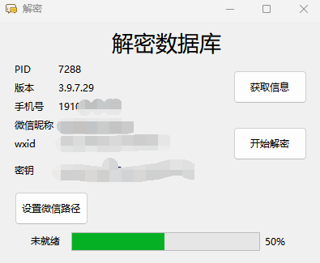
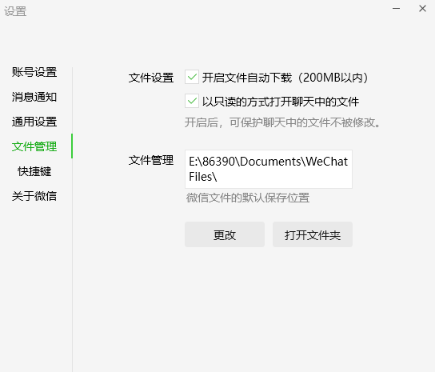
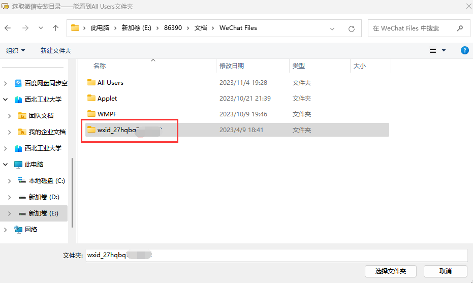

# 开发者手册
## 源码运行

运行前请确保您的电脑上已经安装了Git、版本不低于3.10的Python、部分第三方库需要用到MSVC,需要提前安装Windows构建工具

### 1. 安装

```shell
# Python>=3.10 仅支持3.10、3.11、3.12,请勿使用其他Python版本
git clone https://github.com/LC044/WeChatMsg
# 网络不好推荐用Gitee
# git clone https://gitee.com/lc044/WeChatMsg.git
cd WeChatMsg
pip install -r requirements.txt -i https://pypi.tuna.tsinghua.edu.cn/simple
```

### 2. 使用

1. 登录微信

手机端使用聊天记录迁移功能将聊天数据迁移到电脑上（可选）

操作步骤：
- 安卓： 手机微信->我->设置->聊天->聊天记录迁移与备份->迁移-> 迁移到电脑微信（迁移完成后重启微信）[否则](https://github.com/LC044/WeChatMsg/issues/27)
- iOS： 手机微信->我->设置->通用->聊天记录迁移与备份->迁移-> 迁移到电脑微信（迁移完成后重启微信）[否则](https://github.com/LC044/WeChatMsg/issues/27)

2. 运行程序

```shell
python main.py
```

3. 点击获取信息



4. 设置微信安装路径(如果自动设置好了就**不用管**了)

可以到微信->设置->文件管理查看



点击**设置微信路径**按钮，选择该文件夹路径下的带有wxid_xxx的路径(没有wxid的话先选择其中一个文件夹不对的话换其他文件夹)



5. 获取到key和微信路径之后点击开始启动
6. 数据库文件保存在./app/DataBase/Msg路径下

### 3. 查看

随便下载一个SQLite数据库查看软件就能打开数据库，例如[DB Browser for SQLite](https://sqlitebrowser.org/dl/)

* [数据库功能介绍](./数据库介绍.md)

## 仓库目录功能介绍

```text
├─app
│  ├─analysis       # 聊天数据分析、画图的实现
│  ├─components     # PyQt写的一些自定义UI组件
│  ├─data           # 存储程序用到的必要数据文件
│  ├─DataBase       # 有关数据库的操作和聊天记录导出
│  ├─decrypt        # 数据库解密
│  ├─log            # 日志存储
│  ├─resources      # 必要的资源文件
│  ├─ui             # ui界面实现
│  │  ├─chat        # 聊天界面
│  │  ├─contact     # 联系人界面
│  │  │  ├─export           # 联系人聊天记录导出
│  │  │  └─userinfo         # 联系人详细信息
│  │  ├─menu        # 菜单栏功能的实现
│  │  ├─QSS         # 样式表
│  │  └─tool        # 工具界面
│  │      ├─get_bias_addr   # 获取微信基址
│  │      ├─pc_decrypt      # 数据库解密
│  │      └─setting         # 设置
│  ├─util           # 用到的一些通用工具（聊天数据解析、音视频处理）
│  │  └─protocbuf
│  └─web_ui         # 年度报告等网页的实现（flask）
│      └─templates  # HTML模板
├─doc               # 文档
└─resource          # pyecharts资源文件，供打包使用
```