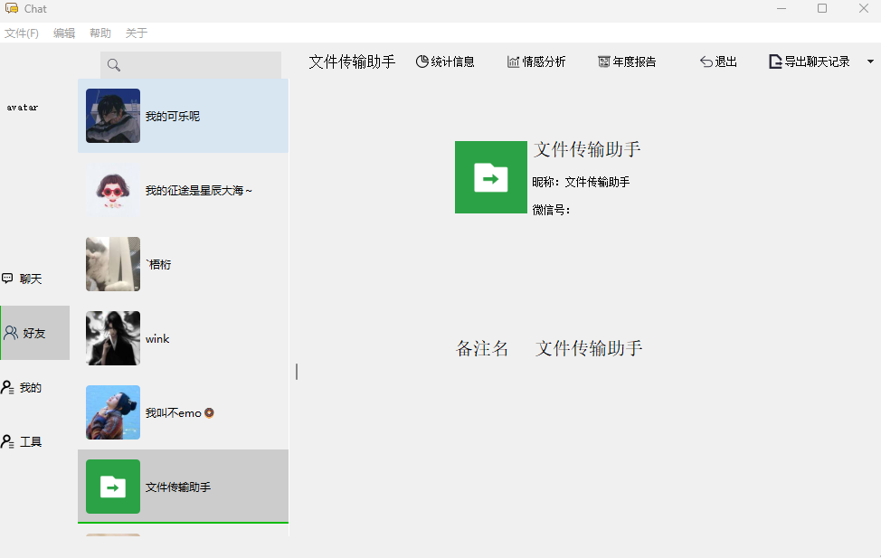
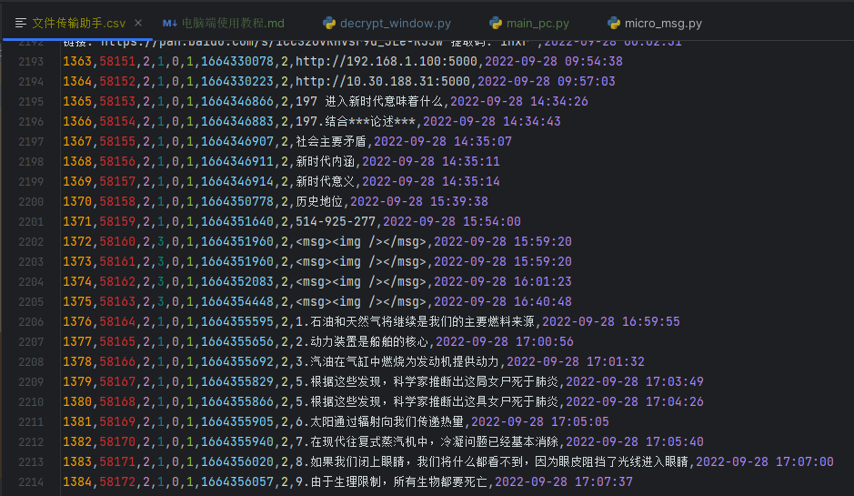

# 一、解密微信数据库

## 主要功能

1. 解密微信数据库
2. 查看聊天记录
3. 导出聊天记录
    * CSV
    * docx(待实现)
    * HTML(待实现)

## 安装

```shell
git clone https://github.com/LC044/WeChatMsg
cd WeChatMsg
pip install -r requirements.txt -i https://pypi.tuna.tsinghua.edu.cn/simple
```

## 解密

<details>

解密步骤:

1. 登录微信

2. 运行程序

   ```shell
   python decrypt_window.py
   ```

3. 点击获取信息

   

4. 设置微信安装路径
   可以到微信->设置->文件管理查看

   

   点击**设置微信路径**按钮，选择该文件夹路径下的带有wxid_xxx的路径
   

5. 获取到密钥和微信路径之后点击开始解密

6. 解密后的数据库文件保存在./app/DataBase/Msg路径下

</details>

## 查看聊天记录

<details>

1. 运行程序

```shell
python main.py
```

2. 选择联系人



3. 导出聊天记录

聊天记录保存在 **/data/聊天记录/** 文件夹下



</details>