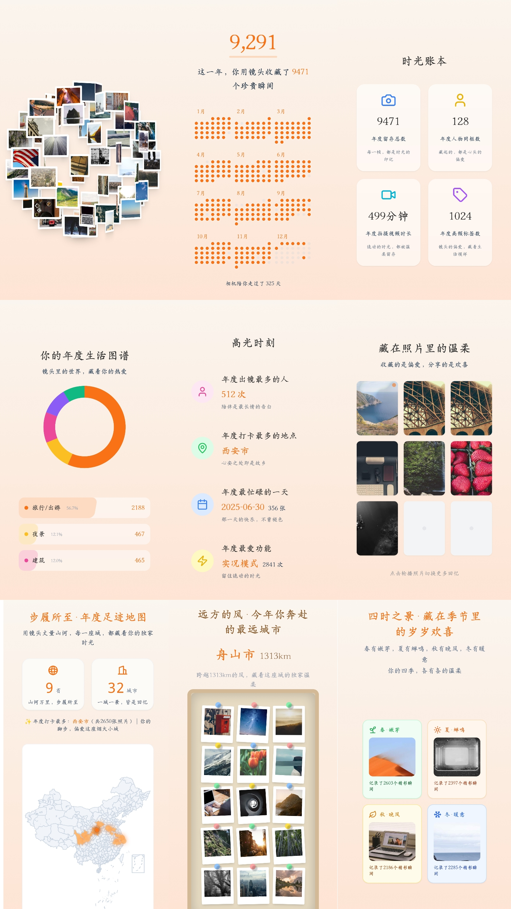

<h1 align="center">我的数据我做主</h1>

    
    
    
    

    

<blockquote>

  

    

    <h2>前言</h2>
    

        
        
我深信有意义的不是微信，而是隐藏在对话框背后的一个个<strong>深刻故事</strong>。未来，每个人都能拥有AI的陪伴，而你的数据能够赋予它有关于你过去的珍贵记忆。我希望每个人都有将自己的生活痕迹👨‍👩‍👦👚🥗🏠️🚴🧋⛹️🛌🛀留存的权利，而不是遗忘💀。

        
AI的发展不仅仅是技术的提升，更是情感💞的延续。每一个对话、每一个互动都是生活中独一无二的片段，是真实而动人的情感交流。因此，我希望AI工作者们能够<strong>善用这些自己的数据</strong>，用于培训独特的、属于个体的人工智能。让<strong>个人AI成为生活中的朋友</strong>，能够理解、记录并分享我们的欢笑、泪水和成长。

        
那天，AI不再是高不可攀的存在，而是融入寻常百姓家的一部分。因为<strong>每个人能拥有自己的AI</strong>，将科技的力量融入生活的方方面面。这是一场关于真情实感的革命，一场让技术变得更加人性化的探索，让我们共同见证未来的美好。

        
<strong>所以《留痕》</strong>

    

  

</blockquote>

> 此项目很久没有（也不会）更新了（未来也许会考虑截图+OCR实现，也许一年或许十年）

我最近在做一个[AI相册项目](https://github.com/LC044/TrailSnap)， 这是一个智能化的 AI 相册应用，致力于帮助用户轻松记录、整理和回顾自己的出行经历。通过强大的 AI 处理能力，让每一张照片和每一段旅程都成为值得珍藏的记忆。

我相信未来每个人（至少每个家庭）都有一个属于自己的 AI 数据中心，而相册是数据中心的一个重要数据来源，它留存了你生活中的很多瞬间，而 AI 相册则是将这些瞬间转化为有价值的记忆，它可以帮你默默地记录下相册里的车票、景点门票，可以帮你记录旅行中的所见所闻，可以帮你自动整理出可以发朋友圈的照片（甚至帮你准备好文案），可以帮你剪一段15s的短视频······。

所以，我给这个项目初步命名为 **《行影集》**，在这里你的数据才 **“真正属于你”**。

目前，项目正处于长期迭代开发阶段，诚挚邀请你体验试用，并随时在开源仓库提出宝贵的意见与建议。

开源地址：[https://github.com/LC044/TrailSnap](https://github.com/LC044/TrailSnap)

2025年度报告将在这个项目实现

## 其他项目

* [EasyBox-一个实用多功能工具箱](https://github.com/LC044/EasyBox)
  * PDF转Word、PDF合并
  * 网页转PDF
  * 根据文件名修改图片的拍摄时间

## 2024年度报告

### 预览

[个人年度报告在线预览](https://memotrace.cn/2024/single/)

[双人年度报告在线预览](https://memotrace.cn/2024Report/)

### 源码地址

[https://github.com/LC044/AnnualReport](https://github.com/LC044/AnnualReport)

# License

WeChatMsg is licensed under [MIT](./LICENSE).

Copyright © 2022-2024 by SiYuan.
