## [留下你对2024年度聊天报告的期待](https://github.com/LC044/WeChatMsg/issues/532)

<h1 align="center">我的数据我做主</h1>

    
    
    
    
    
    
    

    

<blockquote>

  

    

    <h2>前言</h2>
    

        
        
我深信有意义的不是微信，而是隐藏在对话框背后的一个个<strong>深刻故事</strong>。未来，每个人都能拥有AI的陪伴，而你的数据能够赋予它有关于你过去的珍贵记忆。我希望每个人都有将自己的生活痕迹👨‍👩‍👦👚🥗🏠️🚴🧋⛹️🛌🛀留存的权利，而不是遗忘💀。

        
AI的发展不仅仅是技术的提升，更是情感💞的延续。每一个对话、每一个互动都是生活中独一无二的片段，是真实而动人的情感交流。因此，我希望AI工作者们能够<strong>善用这些自己的数据</strong>，用于培训独特的、属于个体的人工智能。让<strong>个人AI成为生活中的朋友</strong>，能够理解、记录并分享我们的欢笑、泪水和成长。

        
那天，AI不再是高不可攀的存在，而是融入寻常百姓家的一部分。因为<strong>每个人能拥有自己的AI</strong>，将科技的力量融入生活的方方面面。这是一场关于真情实感的革命，一场让技术变得更加人性化的探索，让我们共同见证未来的美好。

        
<strong>所以《留痕》</strong>

    

  

</blockquote>

## 🍉功能
-  

- 🔒️🔑🔓️Windows本地微信数据库
- 还原微信聊天界面
    - 🗨文本✅
    - 🏝图片✅
    - 拍一拍等系统消息✅ 
- 导出数据
  - 批量导出数据✅ 
  - 导出联系人✅ 
  - sqlite数据库✅ 
  - HTML✅ 
    - 文本、图片、视频、表情包、语音、文件、分享链接、系统消息、引用消息、合并转发的聊天记录、转账、音视频通话、位置分享、名片、小程序、视频号
    - 支持时间轴跳转
    - 引用消息可定位到原文
    - 分享链接、小程序支持超链接跳转
    - 合并转发的聊天记录支持展开
  - CSV文档✅ 
  - TXT文档✅ 
  - Word文档✅
- 分析聊天数据，做成[可视化年报](https://memotrace.cn/demo.html)

## 🥤效果

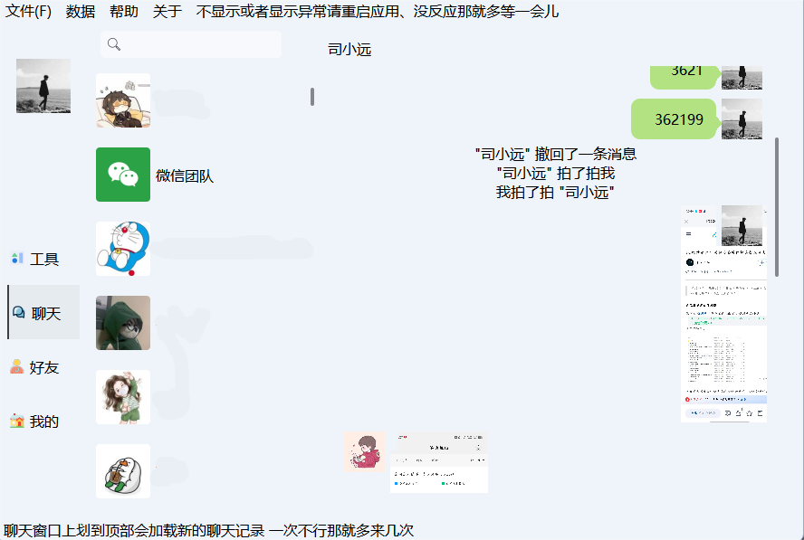

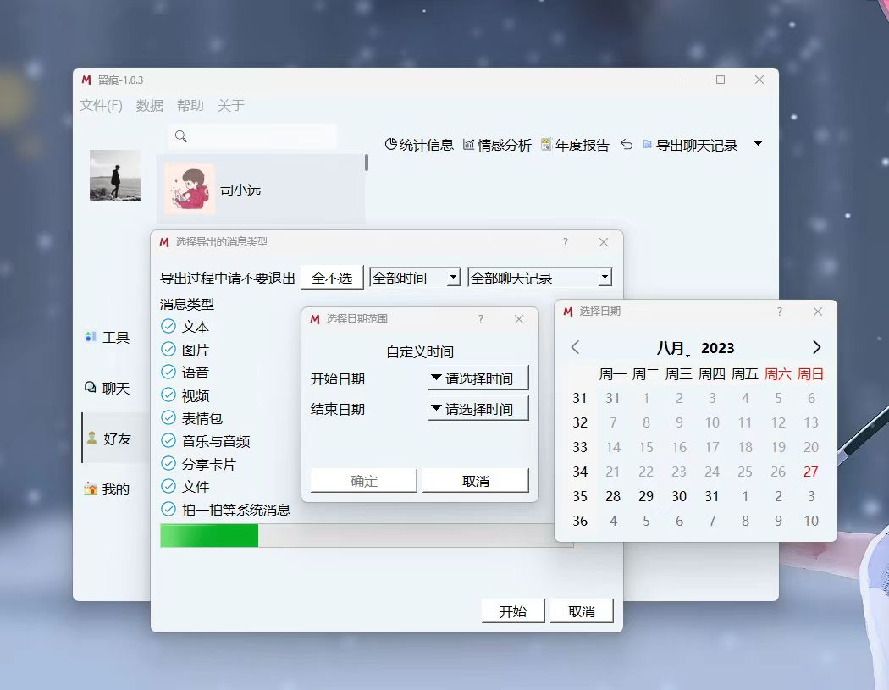

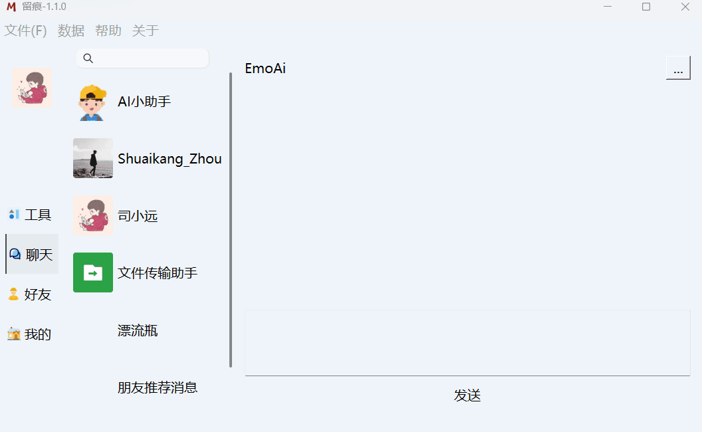

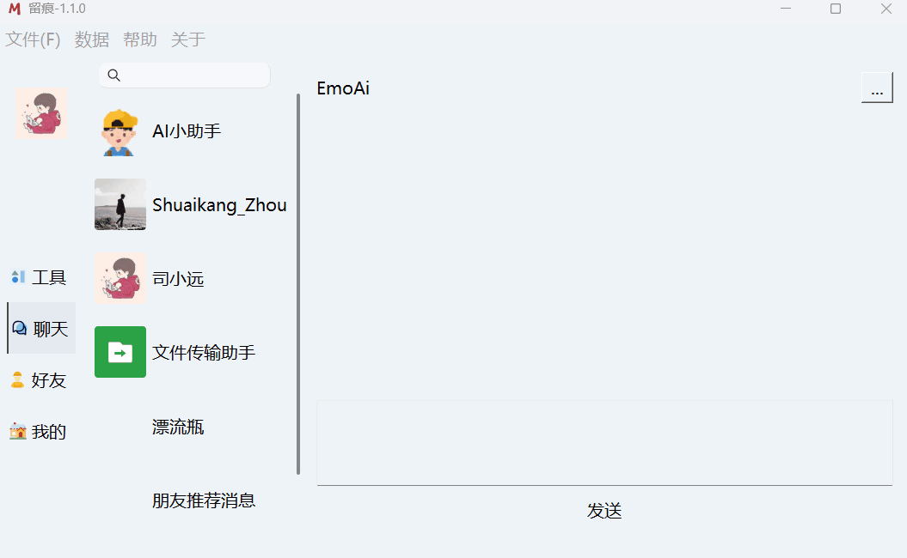

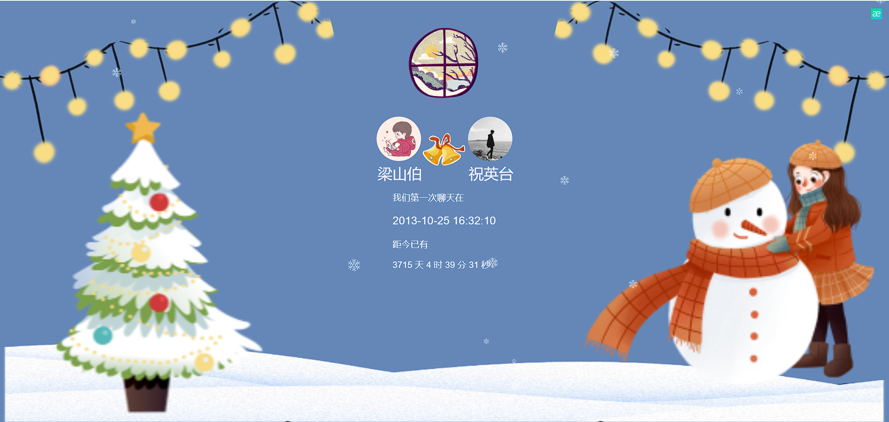

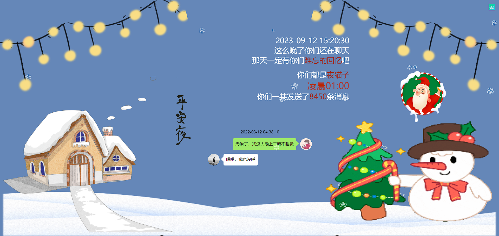

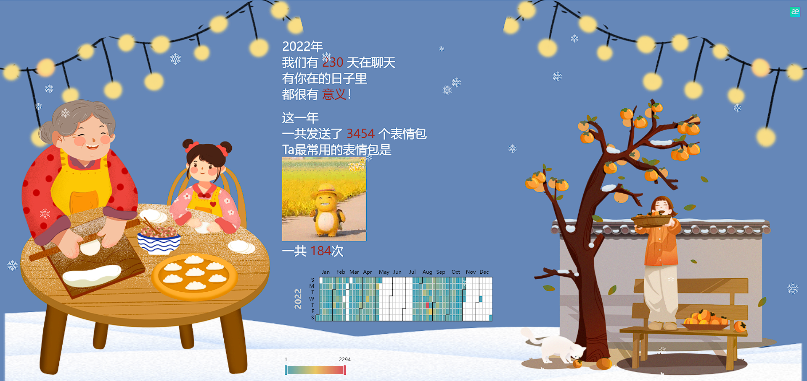

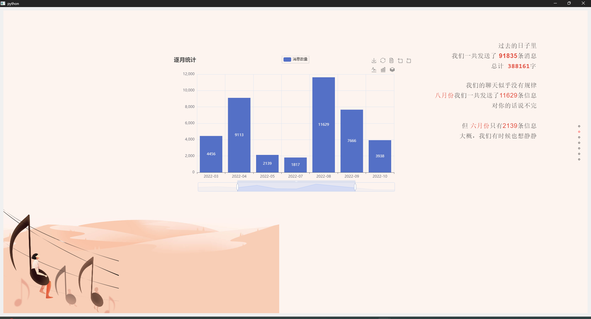

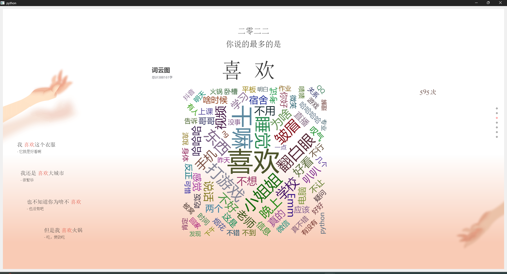

# ⌛使用

下载地址：[https://memotrace.cn/](https://memotrace.cn/)

下载打包好的exe可执行文件，双击即可运行

**⚠️注意：若出现闪退情况请右击选择用管理员身份运行exe程序，该程序不存在任何病毒，若杀毒软件提示有风险选择略过即可，key为none可重启电脑**

## 源码运行

[详见开发者手册](./doc/开发者手册.md)

[AI聊天](./MemoAI/readme.md)

## PC端使用过程中部分问题解决（可参考）

#### 🤔如果您在pc端使用的时候出现问题，可以先参考以下方面，如果仍未解决，可以在群里交流~

* 不支持Win7
* 不支持Mac(未来或许会实现)
* 遇到问题四大法宝
  * 首先要删除app/Database/Msg文件夹
  * 重启微信
  * 重启exe程序
  * 重启电脑
  * 换电脑
如果您在运行可执行程序的时候出现闪退的现象，请右击软件使用管理员权限运行。

[查看详细教程](https://memotrace.cn/doc/)

# 🏆致谢

* PC微信工具:[https://github.com/xaoyaoo/PyWxDump](https://github.com/xaoyaoo/PyWxDump)
* PyQt组件库:[https://github.com/PyQt5/CustomWidgets](https://github.com/PyQt5/CustomWidgets)
* 得力小助手:[ChatGPT](https://chat.openai.com/)

---
> \[!IMPORTANT]
> 
> 声明：该项目有且仅有一个目的：“留痕”——我的数据我做主，前提是“我的数据”其次才是“我做主”，禁止任何人以任何形式将其用于任何非法用途，对于使用该程序所造成的任何后果，所有创作者不承担任何责任🙄 
> 该软件不能找回删除的聊天记录，任何企图篡改微信聊天数据的想法都是无稽之谈。 
> 本项目所有功能均建立在”前言“的基础之上，基于该项目的所有开发者均不能接受任何有悖于”前言“的功能需求，违者后果自负。 
> 如果该项目侵犯了您或您产品的任何权益，请联系我删除 
> 软件贩子勿扰，违规违法勿扰，二次开发请务必遵守开源协议

# 🤝贡献者

## 赞助者名单

感谢以下赞助者的慷慨支持：

- [STDquantum](https://github.com/STDquantum)
- [xuanli](https://github.com/xuanli)
- [无名路人](https://github.com/wumingluren)
- [时鹏亮](https://shipengliang.com)

# 🎄温馨提示

如果您在使用该软件的过程中

* 发现新的bug
* 有新的功能诉求
* 操作比较繁琐
* 觉得UI不够美观
* 等其他给您造成困扰的地方

请提起[issue](https://github.com/LC044/WeChatMsg/issues)，我将尽快为您解决问题

如果您是一名开发者，有新的想法或建议，欢迎[fork](https://github.com/LC044/WeChatMsg/forks)
该项目并发起[PR](https://github.com/LC044/WeChatMsg/pulls)，我将把您的名字写入贡献者名单中

# 联系方式

如果您遇到了问题，可以添加QQ群寻求帮助，由于精力有限，不能回答所有问题，所以还请您仔细阅读文档之后再考虑是否入群

## 加群方式

1. 关注官方公众号，回复：联系方式
2. QQ扫码入群

后续更新将会在公众号同步发布

  
  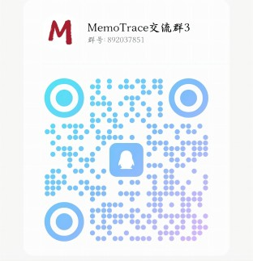

## AI交流

欢迎对“前言”中AI感兴趣的加入QQ群（不负责任何答疑），让我们一起探讨新技术，钻研新方案，将科技的力量融入生活，打造出一个真正具有情感的个人AI

  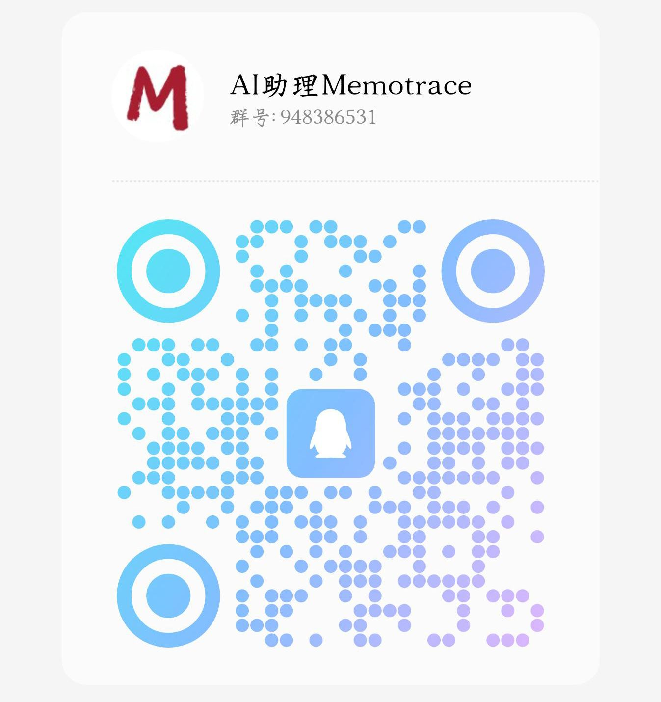

# License

WeChatMsg is licensed under [GPLv3](./LICENSE).

Copyright © 2022-2024 by SiYuan.
