<h1 align="center">我的数据我做主</h1>
<div align="center">

<a href="https://github.com/LC044/WeChatMsg/stargazers">
    
</a>
<a href="https://github.com/LC044/WeChatMsg/issues">
      
    </a>
<a href="./doc/readme.md">
    
</a>
<a href="LICENSE">
    
</a>
</div>

<div align="center">
<a></a>
</div>
<blockquote>
<div style="background-color: #eaf7ea; border-radius: 10px; padding: 20px; position: relative;">
  <div style="position: relative;">
    <div style="position: absolute;top: 0;bottom: 0;left: 0;width: 2px;background-color: #000000;"></div>
    <h2>前言</h2>
    <div style="text-indent: 2em;">
        <p style="text-indent:2em;">我深信有意义的不是微信，而是隐藏在对话框背后的一个个<strong>深刻故事</strong>。未来，每个人都能拥有AI的陪伴，而你的数据能够赋予它有关与你过去的珍贵记忆。我希望每个人都有将自己的生活痕迹👨‍👩‍👦👚🥗🏠️🚴🧋⛹️🛌🛀留存的权利，而不是将之遗忘💀。</p>
        <p style="text-indent:2em;">AI的发展不仅仅是技术的提升，更是情感💞的延续。每一个对话、每一个互动都是生活中独一无二的片段，是真实而动人的情感交流。因此，我希望AI工作者们能够<strong>善用这些自己的数据</strong>，用于培训独特的、属于个体的人工智能。让<strong>个人AI成为生活中的朋友</strong>，能够理解、记录并分享我们的欢笑、泪水和成长。</p>
        <p style="text-indent:2em;">那天，AI不再是高不可攀的存在，而是融入寻常百姓家的一部分。因为<strong>每个人能拥有自己的AI</strong>，将科技的力量融入生活的方方面面。这是一场关于真情实感的革命，一场让技术变得更加人性化的探索，让我们共同见证未来的美好。</p>
        <p align="center"><strong>所以《留痕》</strong></p>
    </div>
  </div>
</div>
</blockquote>

## 🍉功能

- 解密📱手机本地微信数据库🐶
- 解密💻PC端本地微信数据库🐶
- 还原微信聊天界面
    - 🗨文本✅
    - 🏝图片✅
    - 🐻‍❄️表情包✅
- 导出聊天记录
    - sqlite数据库✅
    - HTML(文本、图片)✅
    - Word文档✅
    - CSV文档✅
- 分析聊天数据，做成可视化年报
- 🔥**项目持续更新中**
    - 导出全部表情包❎
    - 合并多个备份数据❎
    - 语音❎
    - 视频❎
    - 文件❎
    - 回复❎
    - 拍一拍❎
- 小伙伴们想要其他功能可以留言哦📬
- 有任何问题可以随时联系我(863909694@qq.com)

为了方便大家交流，我新建了一个QQ群💬：**474379264**

大家有任何想法💡、建议或bug可以群里反馈给我

[//]: # (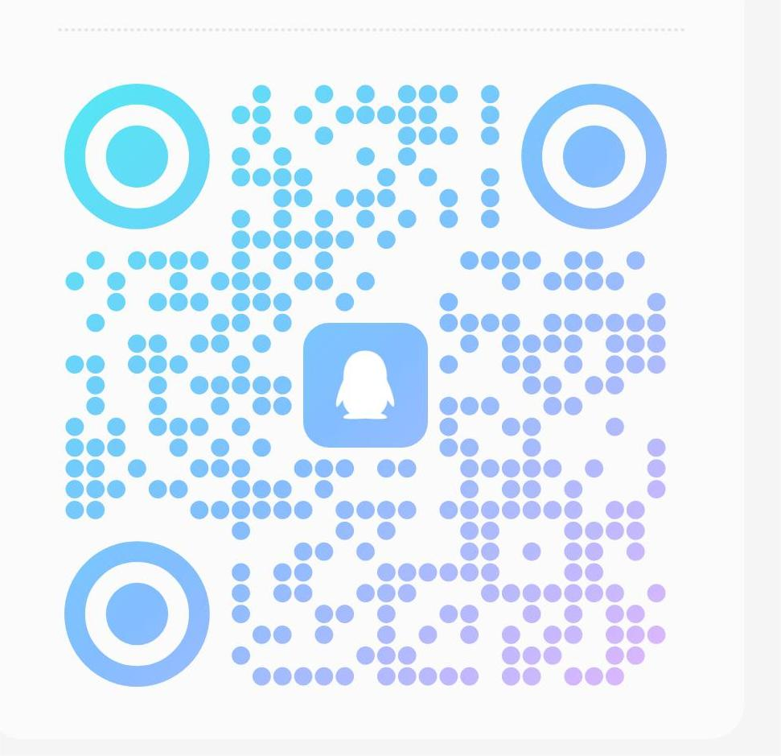)

## 🥤效果

<details>

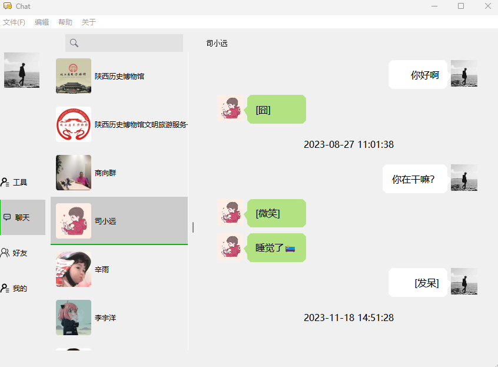

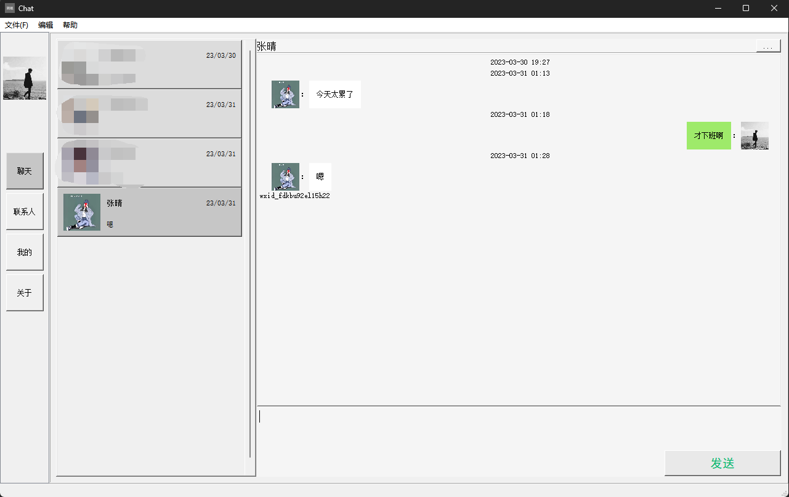

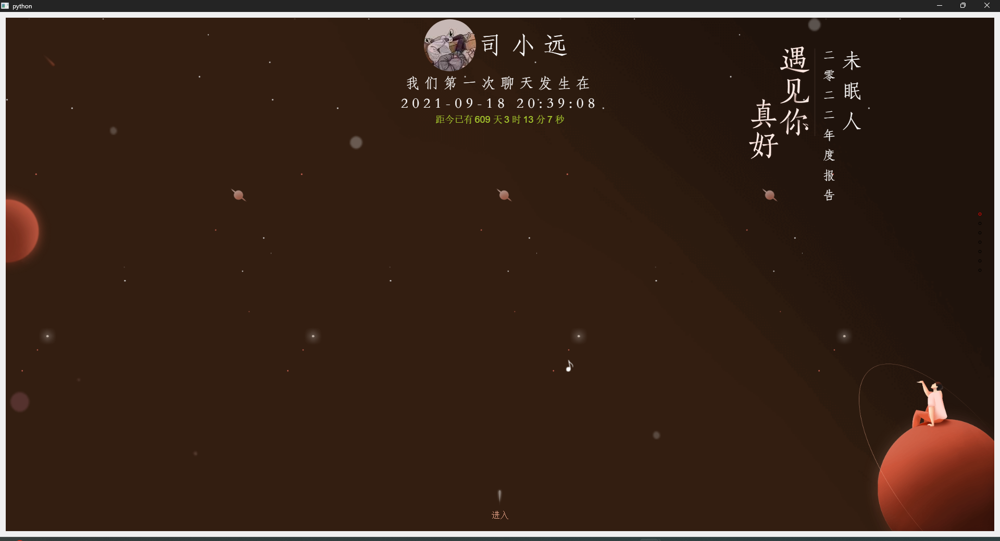


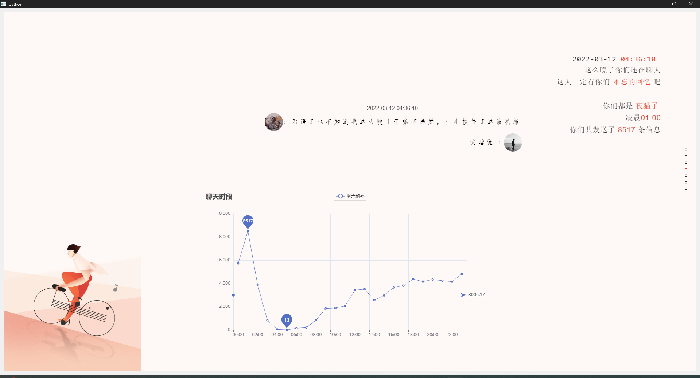

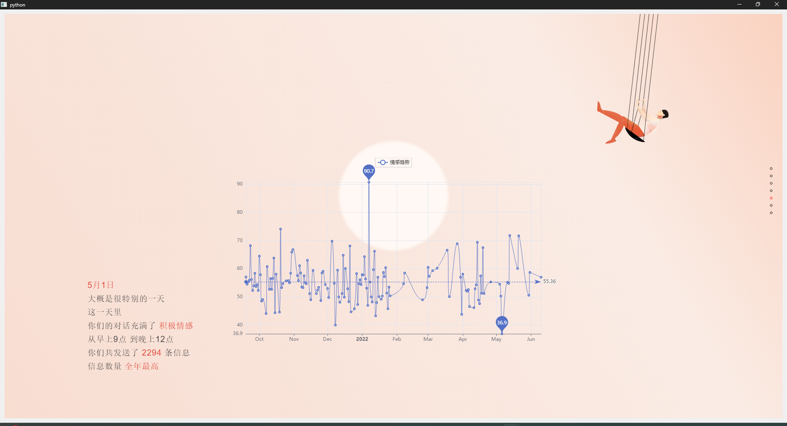

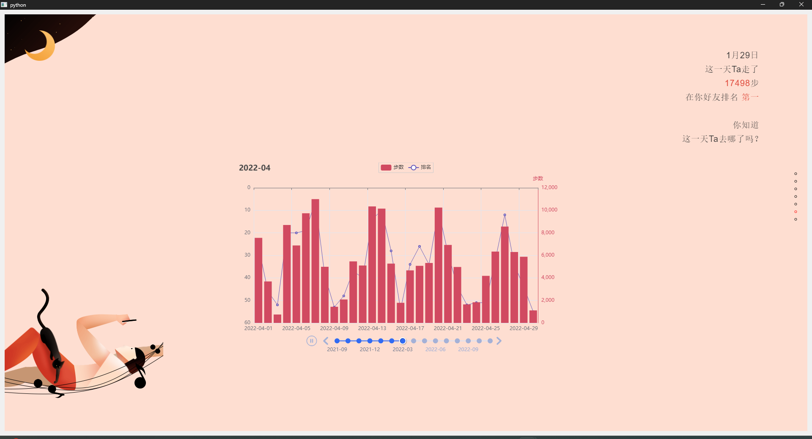

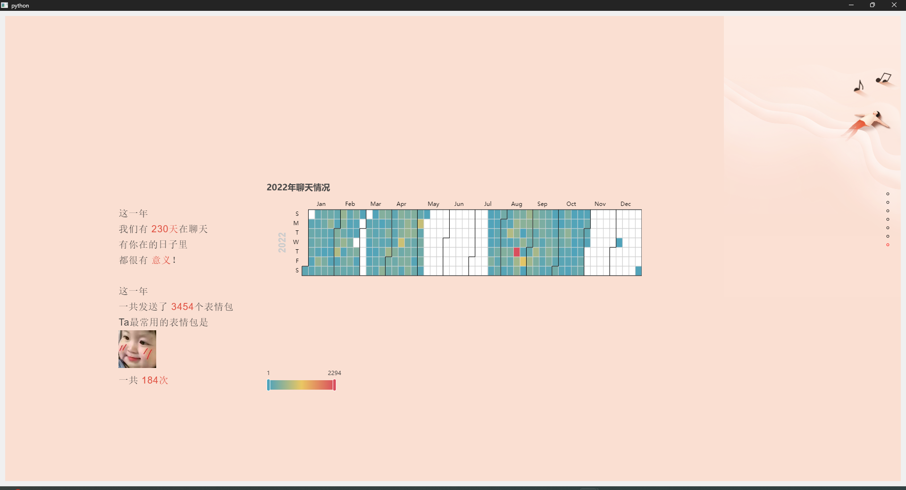

</details>

# ⌛使用

小白可以先点个star⭐(💘项目不断更新中),然后去旁边[Release](https://github.com/LC044/WeChatMsg/releases)
下载打包好的exe可执行文件，双击即可运行

**⚠️注意：若出现闪退情况请右击选择用管理员身份运行exe程序，该程序不存在任何病毒，若杀毒软件提示有风险选择略过即可**

**不懂编程的请移步[Release](https://github.com/LC044/WeChatMsg/releases)，下面的东西看了可能要长脑子啦🐶**

## PC版微信

<details>

### 1. 安装

```shell
# Python>=3.10
git clone https://github.com/LC044/WeChatMsg
cd WeChatMsg
pip install -r requirements_pc.txt -i https://pypi.tuna.tsinghua.edu.cn/simple
```

### 2. 使用

1. 登录微信

手机端使用聊天记录迁移功能将聊天数据迁移到电脑上

操作步骤：我->设置->聊天->聊天记录迁移与备份->迁移->
迁移到电脑微信（迁移完成后重启微信）[否则](https://github.com/LC044/WeChatMsg/issues/27)

2. 运行程序

```shell
python main_pc.py
```

3. 点击获取信息


4. 设置微信安装路径(如果自动设置好了就**不用管**了)

可以到微信->设置->文件管理查看


点击**设置微信路径**按钮，选择该文件夹路径下的带有wxid_xxx的路径(没有wxid的话先选择其中一个文件夹不对的话换其他文件夹)


5. 获取到密钥和微信路径之后点击开始解密
6. 解密后的数据库文件保存在./app/DataBase/Msg路径下

### 3. 查看

随便下载一个SQLite数据库查看软件就能打开数据库，例如[DB Browser for SQLite](https://sqlitebrowser.org/dl/)
（不懂SQL的稍微学下SQL咱再来，或者自动跳过该步骤直接往下看最终效果）

* [数据库功能介绍](./doc/数据库介绍.md)
* [更多功能介绍](./doc/电脑端使用教程.md)

显示效果


### 4. pc端功能展示

恭喜你解密成功，来看看效果吧~

#### 4.1 最上方导航栏

可以点击获取教程，相关信息，导出全部信息的csv文件。


#### 4.2 聊天界面

点击**左侧导航栏——>聊天**
，会随机跳转到某一个好友的界面，滚轮滚动，可以向上翻看更早的聊天记录（温馨提示：可能在翻的时候会有卡顿的现象，是因为数据加载需要时间，后期我们会继续优化嗷~
）。目前聊天记录中文字、图片、表情包基本可以正常显示~


当你想要查找某一位好友的信息时，可以在图中红框输入信息，点击Enter回车键，进行检索


#### 4.3 好友界面

点击**左侧导航栏——>好友**，会跳转到好友的界面，同样可以选择好友，右上方导航栏中有（1）统计信息（2）情感分析（3）年度报告（4）退出（5）导出聊天记录：可选择导出为word、csv、html格式。


**功能部分未集成或开发，请您耐心等待呀~**

</details>

## PC端使用过程中部分问题解决（可参考）

<details>

#### 🤔如果您在pc端使用的时候出现问题，可以先参考以下方面，如果仍未解决，可以在群里交流~

如果您遇到下图所示的问题，是由于没有在电脑端登录微信


如果您遇到下图所示的问题，需要先运行`decrypt_window`的可执行文件或者源代码文件

```
python decrypt_window.py
```


如果您在运行可执行程序的时候出现闪退的现象，请右击软件使用管理员权限运行。


如果您在获取信息的时候，`wxid`
显示none，但是密钥是存在的，需要在微信文件保存的路径中选择该文件夹路径下的带有wxid_xxx的名字，填到wxid位置并继续点击`开始启动`


如果出现如图所示的报错信息，将`app/database/msg`文件夹删除，重新运行`main_pc.py`。


导出数据成功之后，该文件位置与exe文件位置相同（或者在源码.data文件下）


#### 🤔注意

解密一个微信数据库之后，登录新的微信并不会实时更改

</details>

## 使用模拟器（支持可视化分析）

<details>

**不推荐使用，PC端微信可视化功能马上实现**

1. 根据[教程](https://blog.csdn.net/m0_59452630/article/details/124222235?spm=1001.2014.3001.5501)获得两个文件
    - auth_info_key_prefs.xml——解析数据库密码
    - EnMicroMsg.db——聊天数据库
    - **上面这两个文件就可以**
2. 安装依赖库

python版本>=3.10

**说明:用到了python3.10的match语法，不方便更换python版本的小伙伴可以把match(运行报错的地方)更改为if else**

命令行运行以下代码（**建议使用Pycharm打开项目，Pycharm会自动配置好所有东西，直接运行main.py即可**）

```bash
pip install -r requirements.txt -i https://pypi.tuna.tsinghua.edu.cn/simple
```

运行main.py

```bash
python main.py
```

3. 出现解密界面

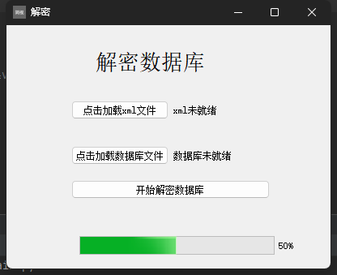

按照提示选择上面获得的两个文件，等待解密完成，重新运行程序

4. 进入主界面

这时候不显示头像，因为头像文件没有导入进来

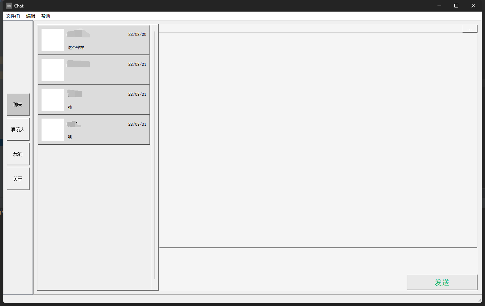

根据[教程](https://blog.csdn.net/m0_59452630/article/details/124222235?spm=1001.2014.3001.5501)
将头像文件夹avatar复制到工程目录./app/data/目录下

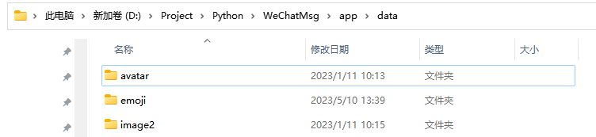

如果想要显示聊天图像就把[教程](https://blog.csdn.net/m0_59452630/article/details/124222235?spm=1001.2014.3001.5501)
里的image2文件夹复制到./app/data文件夹里，效果跟上图一样

复制进来之后再运行程序就有图像了


</details>

## 项目还有很多bug，希望大家能够及时反馈

项目地址：https://github.com/LC044/WeChatMsg

# 🏆致谢

* PC微信解密工具:[https://github.com/xaoyaoo/PyWxDump](https://github.com/xaoyaoo/PyWxDump)
* 我的得力助手:[ChatGPT](https://chat.openai.com/)

---

> 声明：该项目有且仅有一个目的：“留痕”——我的数据我做主，前提是“我的数据”其次才是“我做主”，禁止任何人以任何形式将其用于任何非法用途，对于使用该程序所造成的任何后果，所有创作者不承担任何责任🙄

[](https://star-history.com/?utm_source=bestxtools.com#LC044/WeChatMsg&Date)

# 🎄温馨提示

如果您在使用该软件的过程中

* 发现新的bug
* 有新的功能诉求
* 操作比较繁琐
* 觉得UI不够美观
* 等其他给您造成困扰的地方

请提起[issue](https://github.com/LC044/WeChatMsg/issues)或者添加QQ群(进群前先点个⭐哦):[**474379264**](doc/images/qq.jpg)
，我将尽快为您解决问题

如果您是一名开发者，有新的想法或建议，欢迎[fork](https://github.com/LC044/WeChatMsg/forks)
该项目并发起[PR](https://github.com/LC044/WeChatMsg/pulls)，我将把您的名字写入贡献者名单中